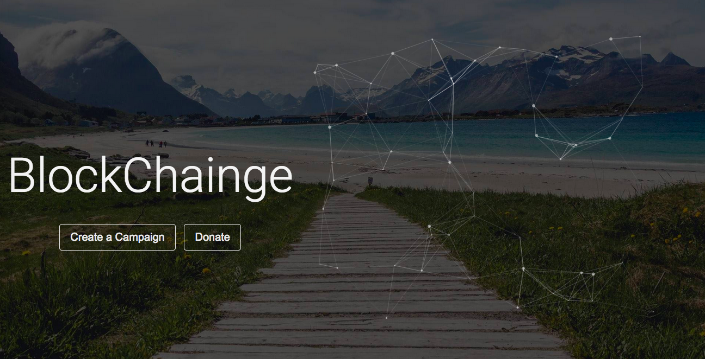

# BlockChainge

Every donor wants to know where their money goes, and current crowdsourcing platforms feature high processing fees and low transparency. 
BlockChainge is a decentralized solution, which features low transaction fees (mining cost) and a tier based donation payout. This ensures the 
recipient is transparent with where the money goes.

Current platforms have processing fees (ex. 2.9% + $0.3 per donation), and some even take 5% off the entire donation.

BlockChainge features under $0.10 donation costs, and this will be for mining the transaction. Moreover, BlockChainge strives to ensure 
utmost transparency and decentralization (ex. IPFS). 
Campaigns feature checkpoints. Thus, the total amount for the campaign is broken down into smaller goals. Individuals donate to these smaller goals 
(or checkpoints), and they can cancel anytime before checkpoint payout. After a checkpoint is done, the campaign creator will post on the outcome of the 
checkpoint. If donors are happy, they can continue to support by donating to the next (or future) checkpoints.

Built With: Truffle (Ganache), IPFS, Pingendo, ParticlesJS, Metamask, HTML/CSS, JavaScript(jQuery)
